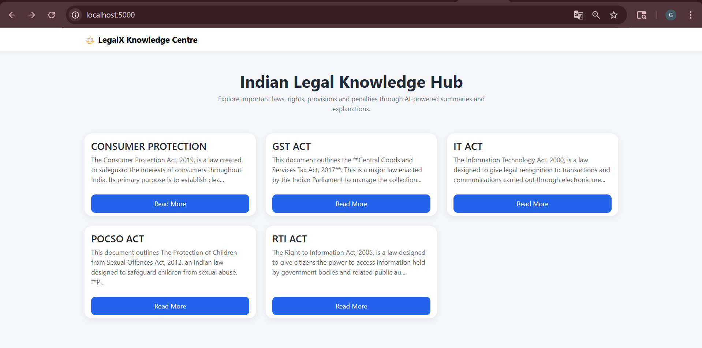
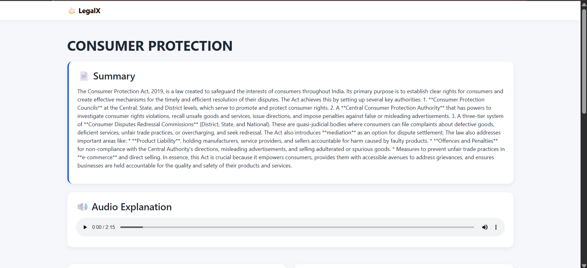
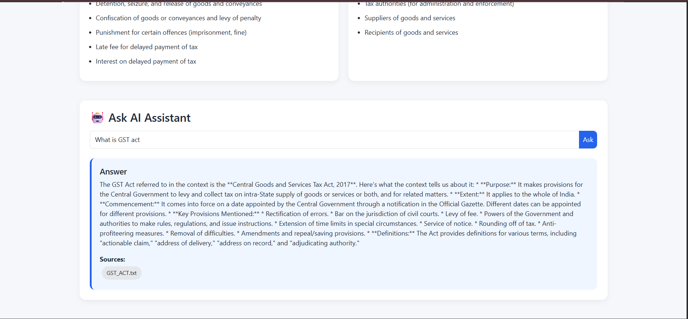

# ⚖️ LegalX – AI-Powered Legal Knowledge Centre

LegalX is an AI-powered legal assistance platform designed to simplify access to Indian legal information. The platform provides concise summaries of legal documents, extracts key legal information, offers audio explanations, and enables users to ask questions through a Retrieval-Augmented Generation (RAG) chatbot.

---

# Features

## Legal Knowledge Cards

Users can browse various legal topics through an intuitive card-based interface.

Currently supported laws:

* POCSO Act
* Right to Information (RTI) Act
* Consumer Protection Act
* GST Compensation Act
* Information Technology (IT) Act / Cyber Crime

---

## AI-Generated Summaries

Each legal document is processed using Google's Gemini model to generate concise and easy-to-understand summaries.

---

## Legal Information Extraction

Important information is automatically extracted from legal documents, including:

* Rights
* Provisions
* Penalties
* Beneficiaries

Structured extraction is performed using Gemini's structured output capabilities and Pydantic models.

---

## Audio Explanations

Every legal topic includes an audio version of the summary, allowing users to listen instead of reading.

---

## AI Legal Assistant

Users can ask questions related to supported laws.

Example questions:

* What is the punishment under POCSO?
* What are consumer rights under the Consumer Protection Act?
* What is the purpose of the RTI Act?
* How is compensation calculated under the GST Compensation Act?

The chatbot answers questions using a Retrieval-Augmented Generation (RAG) pipeline.

---

## Retrieval-Augmented Generation (RAG)

The chatbot uses:

* Sentence Transformers for embeddings
* FAISS for vector search
* Gemini 2.5 Flash for answer generation

This ensures responses are grounded in actual legal documents instead of relying solely on model knowledge.

---

## LangSmith Monitoring

LangSmith is integrated to trace and debug the entire RAG pipeline.

Tracked components include:

* Retrieval
* Context generation
* Prompt construction
* LLM responses

---

# System Architecture

```text
PDF Documents
      │
      ▼
Text Extraction
      │
      ▼
AI Summarization (Gemini)
      │
      ▼
Information Extraction
      │
      ▼
JSON Storage
      │
      ▼
Embedding Generation
(Sentence Transformers)
      │
      ▼
FAISS Vector Store
      │
      ▼
Retriever
      │
      ▼
Gemini 2.5 Flash
      │
      ▼
Final Answer
```

# Project Structure

```text
LegalX/
│
├── app.py
│
├── data/
│   ├── POCSO_ACT.txt
│   ├── RTI_ACT.txt
│   ├── CONSUMER_PROTECTION.txt
│   ├── GST_ACT.txt
│   └── IT_ACT.txt
│
├── generated/
│   ├── summaries.json
│   └── extracted_info.json
│
├── vectorstore/
│   ├── faiss_index.bin
│   └── metadata.pkl
│
├── audio/
│   ├── POCSO.mp3
│   ├── RTI.mp3
│   ├── GST.mp3
│   └── ...
│
├── modules/
│   ├── summarizer.py
│   ├── extractor.py
│   ├── embeddings.py
│   ├── retriever.py
│   └── rag.py
│
├── static/
│   ├── css/
│   │   └── style.css
│   │
│   └── audio/
│
├── templates/
│   ├── home.html
│   └── topic.html
│
├── requirements.txt
│
└── README.md
```

# Technologies Used

## Backend

* Python
* Flask

## AI & NLP

* Google Gemini 2.5 Flash
* LangChain
* LangChain Google Generative AI
* Sentence Transformers

## Vector Database

* FAISS

## Monitoring

* LangSmith

## Frontend

* HTML5
* CSS3
* Bootstrap 5
* JavaScript

## Audio

* gTTS (Google Text-to-Speech)

---

# nstallation

## Clone Repository

```bash
git clone https://github.com/gaoharimran29-gltich/legalx.git

cd legalx
```

## Install Dependencies

```bash
pip install -r requirements.txt
```

---

# 🔑 Environment Variables

Create a `.env` file in the project root directory.

You can use only GEMINI_API_KEY to test the project. Other envs are just for langsmith monitoring

```env
GEMINI_API_KEY=YOUR_GEMINI_API_KEY

LANGCHAIN_API_KEY=YOUR_LANGSMITH_API_KEY

LANGCHAIN_TRACING_V2=true

LANGCHAIN_PROJECT=LegalX
```

---

# ▶️ Running the Application

Start the Flask server:

```bash
python app.py
```

Open:

```text
http://127.0.0.1:5000
```

---

# 📖 Workflow

## Step 1: Data Collection

Legal documents were collected in PDF format from official government sources.

Examples:

* POCSO Act
* RTI Act
* Consumer Protection Act
* GST Compensation Act
* IT Act

---

## Step 2: Text Extraction

PDF files were converted into plain text format.

Output:

```text
POCSO_ACT.txt
RTI_ACT.txt
CONSUMER_PROTECTION.txt
GST_ACT.txt
IT_ACT.txt
```

---

## Step 3: AI Summarization

Gemini generates concise summaries for each legal document.

Output format:

```json
{
    "POCSO": "Summary..."
}
```

Stored in:

```text
generated/summaries.json
```

---

## Step 4: Information Extraction

Gemini extracts:

* Rights
* Provisions
* Penalties
* Beneficiaries

Output format:

```json
{
    "POCSO": {
        "rights": [],
        "provisions": [],
        "penalties": [],
        "beneficiaries": []
    }
}
```

Stored in:

```text
generated/extracted_info.json
```

---

## Step 5: Embedding Generation

Sentence Transformers generate vector embeddings for legal text chunks.

Model Used:

```text
all-MiniLM-L6-v2
```

---

## Step 6: FAISS Indexing

Embeddings are stored inside a FAISS vector database for fast semantic search.

---

## Step 7: Retrieval

User questions are converted into embeddings and matched against relevant legal chunks.

---

## Step 8: Answer Generation

Retrieved context is passed to Gemini 2.5 Flash, which generates grounded legal answers.

---

# Example Questions

### POCSO

* What is the punishment for penetrative sexual assault?
* Who is protected under POCSO?

### RTI

* Who can file an RTI application?
* What information is exempt from disclosure?

### Consumer Protection

* What are consumer rights?
* How can a consumer file a complaint?

### GST

* What is compensation cess?
* How is compensation calculated under the GST Compensation Act?

### Cyber Crime

* What is identity theft?
* What penalties exist for cyber offences?

---

# Screenshots

## Home Page

<div align="center">
    <picture>
      
    </picture>
</div>

---

## Topic Details Page

<div align="center">
    <picture>
      
    </picture>
</div>

---

## AI Assistant

<div align="center">
    <picture>
      
    </picture>
</div>

---

# Future Improvements

* Multi-language support
* Voice-based legal assistant
* Additional Indian laws and regulations
* PDF upload and analysis
* Legal citation generation
* User authentication
* Chat history support
* Advanced document search

---

# Learning Outcomes

This project helped in understanding:

* Retrieval-Augmented Generation (RAG)
* Vector databases (FAISS)
* Embedding models
* LangChain workflows
* Gemini API integration
* Prompt engineering
* LangSmith tracing and debugging
* Flask web development
* Information extraction from legal documents
* Semantic search systems

---

# 👨‍💻 Author

**Gaohar Imran**

AI/ML Internship Project

Built using:

* Flask
* Gemini 2.5 Flash Lite
* FAISS
* LangSmith
* Sentence Transformers
* Bootstrap 5

---